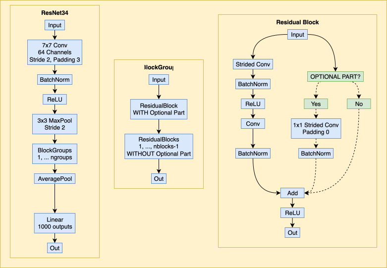
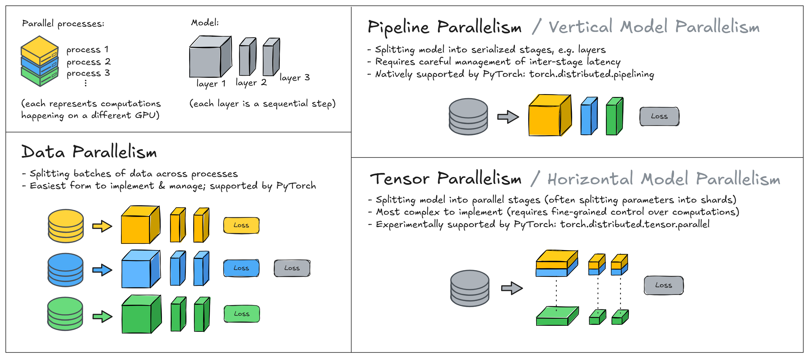

# ARENA

## Fundamentals

### Neural Networks
- What makes neural networks more powerful than basic statistical methods like linear regression?

&emsp;It can learn arbitrarily complex associations, less subject to geometrical constraint (e.g. linear).

- What are the advantages of ReLU activations over sigmoids?

&emsp;Faster computation (point-wise linear), easier gradient computation (—> avoids vanishing gradients because un-saturated).

### Linear Algebra
- What is the problem in trying to create a neural network using only linear transformations?

&emsp;It won't predict complex non-linear relationships. 

- Matrices A and B have shapes (n,m) and (m,l). What is the maximum possible rank of the matrix AB?

&emsp;$\text{min}(n,m,l)$

### Probablity & stats

- What is the expected value and variance of the sum of two independent normally distributed random variables?

$$X_1  \sim \mu_1, \sigma_1 \quad \quad X_2 \sim \mu_2, \sigma_2$$

- What is the derivative of quadratic loss $L(x,y)=\frac{1}{2}(x−y)^2$ wrt the input $x$ (assuming all variables are scalars, not vectors)? How about for cross entropy loss $L(x,y)=−(y \, \text{log} \, x+(1−y) \, \text{log}(1−x))$, assuming that $x$∈(0,1) and y is a binary classification label with value either zero or one? What will be the qualitative behaviour of performing gradient descent on x with these loss functions?

&emsp; **MSE loss**: The derivative of $L$ w.r.t $x$ is $x-y$. Qualitatively it means that the gradient is linearly proportional to the error.

&emsp; **Binary Cross Entropy loss**: The derivative of $L$ w.r.t to $x$ is $-\frac{y}{x}+\frac{1-y}{1-x}$, which is $-\frac{1}{x}$ when $y=1$ and $\frac{1}{1-x}$ when $y=0$. Qualitatively, it means the gradient increases/decreases by the inverse of the error in the desired direction, and can be very large when $x$ is close to $1-y$ (i.e. non-linear).

### Information Theory

$$D_{\text{KL}}(P||Q) = \sum_{x \in X} P(x) \log \frac{P(x)}{Q(x)} = p \log p - p \log q$$

i.e. "difference in entropy" between $P$ and $Q$. 

It can be re-written in terms of cross entropy $H(p,q) = H(p) + D_{\text{KL}}(p||q)$ where $H(p)$ is the entropy of $P \quad  \longrightarrow \quad D_{\text{KL}}(p||q) = H(p,q) - H(p)$. 

Standard cross-entropy equation is $H(p,q) = -p \log q$.

- Suppose $P$ is the probability distribution of which word comes next in natural language, and $Q$ is a language model's estimated probability distribution. What will the cross entropy $H(P,Q)$ be if the model is guessing words uniformly? What will the cross entropy be if the model can predict words with the exact right frequency?

&emsp; If model is guessing uniformly, then $H(p,q) = -p \log q = -p \log \frac{1}{|V|} = \log |V|$ where V is the vocab set, i.e. $|V|$ is the size of the vocab.  

&emsp; If the model is guessing similarly as $P$, $H(p,q) = -p \log q = -p \log p = H(P)$.

### Programming

#### PyTorch

- what is `nn.Parameter` and `nn.Module`?

A parameter is sub-class of Tensor that contains learnable values that gets updated durng training. You assign a Parameter in a Module. 
Module is a base class for all neural network object, it keeps track of parameters, implements the forward method, etc. 

- when do you call `.backward()`? where are the gradients stored?

You call backward at the end of every batch in training. The Gradients are stored in the `.grad` attribute of each leaf tensor (the `nn.Parameter` objects) that has `requires_grad=True`.
Leaf tensors are those created manually, like Weights and Biases. Results of hidden layer calculation, i.e. intermediate tensors, are discarded after use to save memory unless you called `.retain_grad()` on them.    
The `.grad` attibute is **additive**, meaning that if you call `backward()` multiple time without clearing the gradients, the new values will be added to existing ones. This is why `optimizer.zero_grad()` is called in training loops. 

- What is a loss function? What does it take for arguments, and what does it return?

The loss function determines how to calculate the gradient based on the difference between the ground truth and the inferred prediction (i.e. the error). It usually as a steepness term that parameterize gradient propagation and a regularization term to avoid exploding/vanishing gradients.  

- What does an optimization algorithm do?

The optimizer computes the loss, gradients and update the weights using a learning rate/step size to minimize loss.

- What is a hyperparameter, and how does it differ from a regular parameter?

A hyperparameter influence the learning process, rather than the internal variables of the model. It is used to guide the learning process to find the optimal solution, e.g. learning rate, number of epochs, activation functions.

### Software Engineering

## CNNs & ResNets

### Modules

**Universal Approximation Theorem:** any continuous function can be approximated using a sufficiently large neural network, if using non-linear activation function.

**Uniform Kaiming initialization:** default in pytorch, each weight and bias are drawn from uniform distribution on interval $[-\frac{1}{\sqrt{N_{in}}}, \frac{1}{\sqrt{N_{in}}}]$.

**Xavier initialization:** $\mathcal{O} \left( [-\frac{1}{\sqrt{N_{in}+N_{out}}}, \frac{1}{\sqrt{N_{in}+N_{out}}}] \right)$

### Training

#### Cross entropy loss

$$\text{loss} = \frac{1}{N} \sum_{n=1}^N  - \text{log} \, p_{n, y_n}$$

where $p_{n,c}$ is the probability the model assigns to class $c$ for sample $n$, and $y_n$ is the true label for this sample.

#### Convolutions

To calculate the size of the output of a convolution:

$$L_{out} = \left\lfloor \frac{L_{in} + 2 \times \text{padding} - \text{kernel\_size}}{\text{stride}} \right\rfloor + 1$$

As a general rule, a 3x3 convolution with $\text{padding}=1$ divides the image size by $\text{strides}$.

### ResNets

#### Batch Normalization

z-scoring activations across a mini-batch, forcing zero mean and unit variance. Introduces two new learnable parameters, ($\gamma$) (scale) and ($\beta$) (shift) $-$ per channel $-$ which allow network to learn optimal variance and mean activations, restoring representational power. 

Prevents vanishing or exploding gradients by keeping activations out of saturating non-linear zones, ensuring stable signal propagation. Bias terms are no longer needed, as they are mathematically subtracted out and absorbed by the batch mean calculation.

#### Architecture

## Optimization

### Gradient Descent
$$\theta_t \leftarrow \theta_{t-1} - \lambda \nabla L(\theta_{t-1})$$

### Momentum (SGD)
$$ z^{k+1} = \beta z^k + \nabla f(w^k) $$
$$ w^{k+1} = w^k + \alpha z^{k+1} $$

### RMSProp
Root mean square propagation. Similar to SGD with an additional dynamic: the size of parameter steps are scaled according to the variance of the past gradients, with higher variance leading to smaller steps.

### ADAM
Adaptive Momentum Estimation.

$\theta$ are the parameters to optimize, $\delta$ is the increment of change at each step, with learning rate $\lambda$. $G$ is the gradient, $G_s$ is the sum of gradients.
$$G_s = G_s \beta_1 + G(1-\beta_1) \quad \quad\text{[Momentum]}$$ 
$$G_{s^2} = G_{s^2} \beta_2 + G^2 (1-\beta_2) \quad \quad\text{[RMSProp]}$$
$$\delta = \frac{-\lambda G_s}{\sum G_{s^2}} $$
$$ \theta = \theta + \delta $$

$\beta_1$ is the decay rates of the first moment (the mean), typically set at 0.9.

$\beta_2$ is the decay rates of the second moment (the variance), typically set at 0.999.

### Distributed Training
**Tensor** (horizontal) vs **Pipeline** (vertical) paralellism.  

Collective communication: `broadcast`, `gather` (all to one, concatenated), `reduce` (like gather, with operation -- sum, mean, etc.).  
`all_gather` and `all_reduce` ensure all processes get the data. 